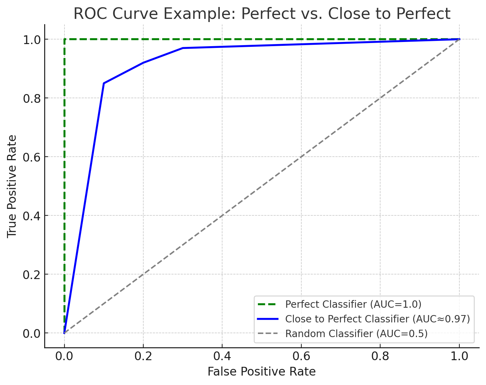

# Training Data

Dataset denotes a set that is finite and stationary. Data in production is neither finite nor stationary, so we call training data rather than training dataset.

Like other steps in ML systems, creating training data is an iterative process. As your model evolves through a project lifecycle, your training data will likely also evolve.

Data is full of potential biases. These biases have many possible causes. There are biases caused during collecting, sampling or labeling. Historical data might be embedded with human biases, and ML models trained on this data, can perpetuate them. Use data but don’t trust it too much!

## Sampling

You don’t have access to all possible data in the real world, the data that you use to train your model is a subset of real-world data.

### Nonprobability Sampling

* Convenience sampling  
* Snowball sampling  
* Judgment sampling  
* Quota sampling

The samples selected by nonprobability sampling criteria are not representative of the real world data and therefore are riddled with selection biases.

But unfortunately in many scenarios we use convenience sampling for example for language models we always use wikipedia, reddit or common crawl.

### Random Sampling

Easy to implement but rare categories of data might not appear in your selection.

### Stratified Sampling

Divide data into groups and sample each group separately but the drawback is that it isn’t always possible, such as when it’s impossible to divide all samples into groups.

### Weighted Sampling

* In weighted sampling each sample is given a weight, which determines the probability of it being selected. This method allows you to leverage domain expertise.

* For example if in your data, red samples account for 25% and blue samples account for 75%, but you know that in the real world, red and blue have equal probability to happen, you can give red samples weights three times higher than blue samples.

* A common concept in ML that is closely related to weighted sampling is sample weights. Weighted sampling is used to select samples to train your model with, whereas sample weights are used to assign weights or importance to training samples. Changing sample weights can change your model’s decision boundaries significantly.

### Reservoir Sampling

* Reservoir sampling is a fascinating algorithm that is especially useful when you have to deal with streaming data.

* First, you fill your reservoir with the first k items from the stream Then, for each subsequent item n (where n > k):  
* Generate a random number j between 1 and n  
* If j ≤ k, replace the j-th item in the reservoir with the new item

This means the each incoming nth element has k/n probability of being in the reservoir. 

```python3
import random 

def reservoir_sample(stream, k):     
    # Initialize reservoir with first k item     
    reservoir = stream[:k]
    # Process remaining items
    for i in range(k, len(stream)):         
        j = random.randrange(i + 1)         
        if j < k:
            reservoir[j] = stream[i]                  
    return reservoir 
```

## **Labeling**

#### **Hand Labels**

* Acquiring hand labels for your data is difficult for many, many reasons. First hand labeling data can be expensive, especially if subject matter expertise is required.

* Ex: If you want to label chest X-rays, you’d need to find board-certified radiologists whose time is limited and expensive.

* Has problems like label multiplicity. Having data lineage for the labeling helps track the data origination and solve any data bugs, flag potential biases in your data and debug your models.

#### **Natural Labels**

* The canonical example of tasks with natural labels is recommender systems.

* Many tasks can be framed as recommendation tasks. For example, you can frame the task of predicting an ad's click-through rate as recommending the most relevant ads to users based on their activity histories and profiles.

* Natural labels that are inferred from users' behaviors like clicks and ratings are also known as behavioral labels.

* Recommendations that don't get clicked on after a period of time can be presumed to be bad. This is called an implicit label, as this negative label is presumed from lack of positive label. It’s different from explicit labels where users explicitly demonstrate their feedback on a recommendation by giving it low rating and downvoting it.

##### **Feedback loop length**

* For taks with natural labels, the time it takes from when a prediction is served until when the feedback on it is provided is the feedback loop length.

#### **Handling lack of labels**

* Weak supervision: Use heuristics to label the unlabelled data (snorkel library).

  * Snorkel are built around the concept of a labeling function (LF).

  * Useful when data strictly has privacy concerns.

* Semi supervision: 

  * Semi supervision leverages assumptions to generate new labels based on a small set of initial labels. Unlike supervision, semi-supervision requires an initial set of labels.

    * Example: You start by training a model on your existing set of labeled data and use this model to make predictions for unlabeled samples.

  * Most useful when your training labels are limited.

* Transfer learning

  * Transfer learning refers to a family of methods where a model developed for a task is reused as the starting point for a model on a second task.

  * Base task is usually a task that has cheap and abundant training data.

* Active learning

  * Active learning is a method for improving the efficiency of data labels. The hope here is that ML models can achieve greater accuracy with fewer training labels if they can choose which data samples to learn from.

  * Instead of randomly labeling data samples, you label the samples that are most helpful to your models to some metrics or heuristics. 

    * The most straightforward metric is uncertainty measurement - label the examples that your model is the least certain about, hoping that they will help your model learn the decision boundary better.

    * Another common heuristics is based on disagreement among multiple candidate models, this method is called query-by-committee

### Class Imbalance

Class imbalance typically refers to a problem in classification tasks where there is a substantial difference in the number of samples in each class of the training data.

Class imbalance can also happen with regression tasks where the labels are continous. Consider the task of estimating health-care bills. Health-care bills are highly skewed - the median bill is low, but the $95^{th}$ percentile bill is astronomical. When predicting hospital bills, it might be more important to predict accurately the bills at $95^{th}$ percentile.

#### Challenges of Class imbalance

* ML, especially works well the data distribution is balanced and usually not so well when the classes are heavily imbalanced.

* The first reason is that class imbalance often means there's insufficient signal for your model to learn to detect the minority classes.

* The second reason is that class imbalance makes it easier for your model to get stuck in nonoptimal solution by exploiting a simpel heuristic instead of learning anything useful about the underlying pattern in the data.

* The third reason is that class imbalance leads to asymmetric costs of error - the cost of a wrong prediction on a sample of the rare class might be much higher than a wrong prediction on a sample of the majority class.

### Handling Class Imbalance

`Japkowicz(Author)` showed that sensitivity to imbalance increases with the complexity of the problem and that non complex, linearly separable problems are unaffected by all levels of class imbalance. Class imbalance in binary classification is a much easier problem than class imbalance in multiclass classification problems.

#### Using the righ evaluation metrics

* Precision, Recall and F1, for binary tasks are calculated using the count of true positives, true negatives, false positives and false negatives.

* F1, preicison and recall are asymmetric metrics, which means that their values change depending on which class is considered the positive class.

* We can plot true positive rate (also known as recall) while decreasing the false positive rate (als known as the probability of flase alarm), and vice versa. This plot is known as the ROC curve.

* When your model is prefect the recall is `1.0` and the curve is just a line at the top.

<p align="center">
    
</p>

* Like F1 and recall, the ROC curve focuses only on the positive class and doesn't show how well your model does on the negative class. Daivs and Goadric authors suggested we should plot precision against recall instead, in what they termed the Precision Recall Curve. They argued this curve gives more informative picture of and algorithm's performance on tasks with heavy class imbalacne.

#### Data-level methods: 
##### Resampling

* Use undersampling or oversampling

* Tomek Links: A popular method of undersampling low-dimensional data that was developed back in 1976 is `Tomek links`. With this technique, you find pairs of samples from opposite classes that are close in proximity and remove the sample of the majority class in each pair. While this makes the decision boundary more clear and arguably helps models learn the boundary better, it may make the model less robust because the model doesn't get to learn from subtleties of the true decision boundary.

* SMOTE: A popular method of oversampling low-dimensional data is SMOTE(synthetic minority oversampling technique). It synthesizes novel sample of the minority classes through sampling convex(linear meaning) combination of existing data points within the minority class.


* Undersampling runs risk of losing important data from removing data. Oversampling runs the risk of overfitting on training, data especially if the added copies of the minority class are replicas of exisiting data.

##### Algorithm-level methods
If data-level methods mitigate the challenge of class imbalancy by altering the distribution of your training data, alorithm-level methods keep the training data distribution intact but alter the algorithm to make it more robust to class imbalance.

* **Cost-sensitive learning**: The method started by using a cost matrix to specify $C_{ij}$: the cost if class $i$ is classified as class $j$. If $i=j$, its correct classification, and the cost is usually $0$.
* **Class-balanced loss**: We make the weight of each class inversely proportional to the number of samples in that class, so that the rarer classes have higher weights.
$$W_{i} = \frac{N}{\text{number of samples of class i}}$$
* **Focal Loss**: Focal Loss is a modified version of cross-entropy loss designed to handle class imbalance by down-weighting the loss for well-classified examples and focusing more on hard-to-classify ones.
$$FL(p_{t}) = -\alpha(1-p_{t})^\gamma \log(p_{t})$$

* when $p_{t}$ is high -> $(1-p_{t})^\gamma$ is small, reducing its contribution to the loss.
* when $p_{t}$ is low -> $(1-p_{t})^\gamma$ is large, increasing its contribution.
